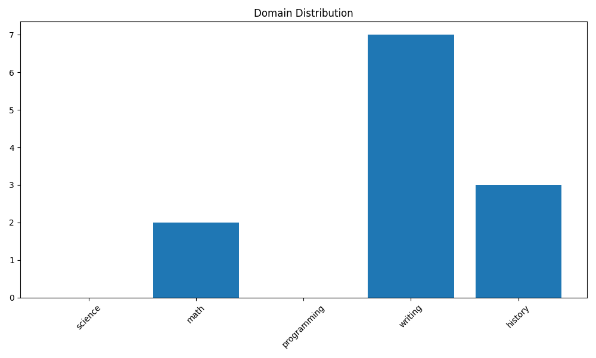
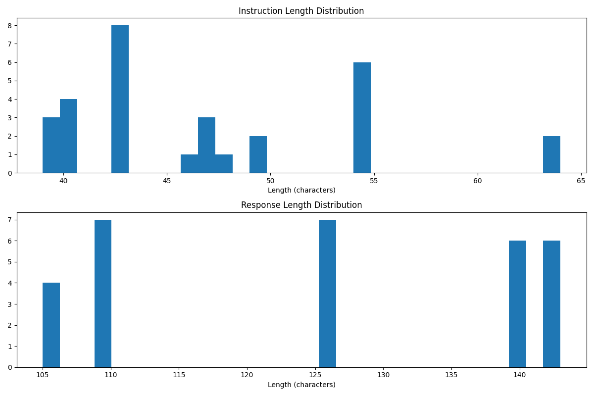
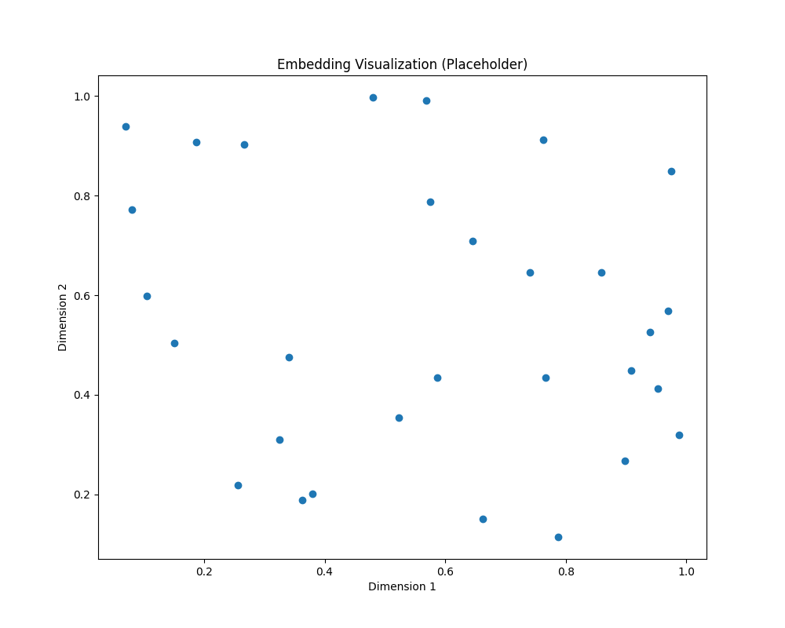

# Dataset Analysis Results

## Basic Statistics

- **total_examples**: 30
- **avg_instruction_length**: 46.86666666666667
- **max_instruction_length**: 64
- **min_instruction_length**: 39
- **avg_response_length**: 125.43333333333334
- **max_response_length**: 143
- **min_response_length**: 105

## Domain Distribution

## Length Distributions

## Embedding Visualization

## Filtering Process

- Original dataset size: 30
- Filtered dataset size: 0
- Percentage retained: 0.00%

### Filtering Criteria

- Toxicity score < 0.3
- Instruction length > 20 characters
- Response length > 50 characters
- Readability score > 30.0
