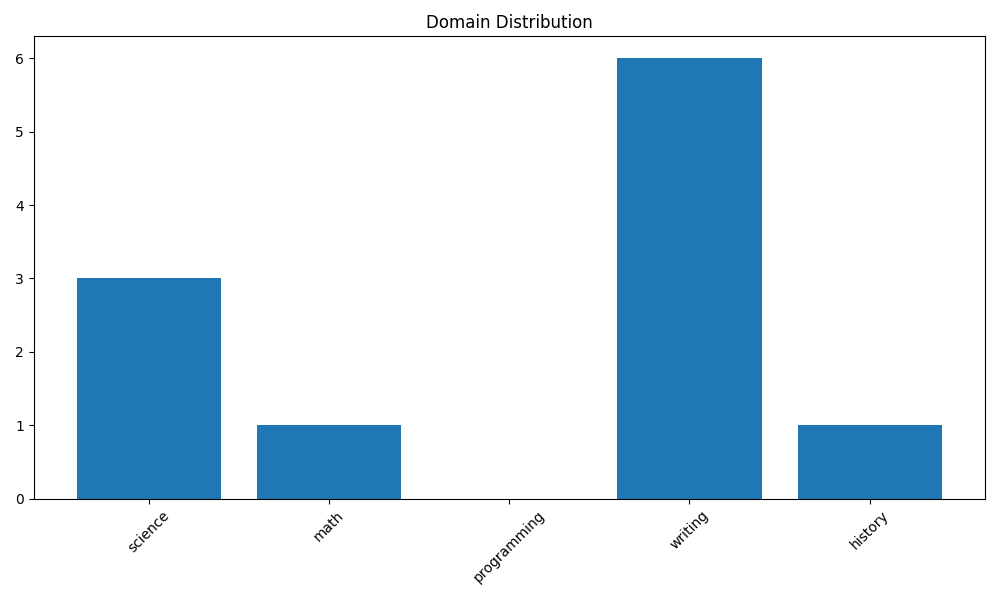
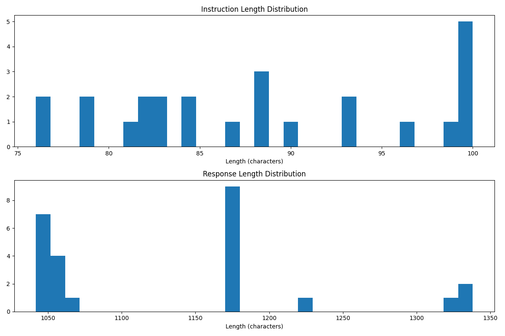
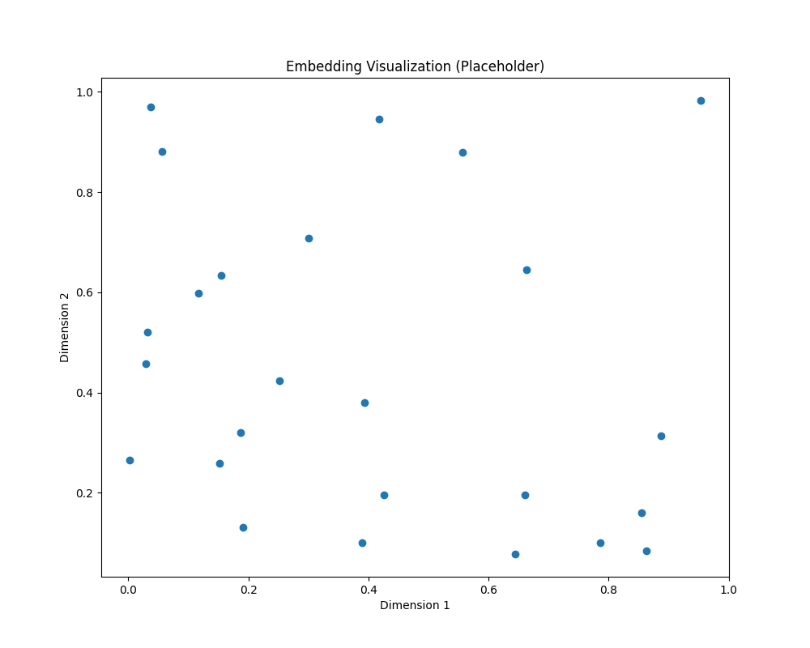

# Dataset Analysis Results

## Basic Statistics

- **total_examples**: 25
- **avg_instruction_length**: 88.44
- **max_instruction_length**: 100
- **min_instruction_length**: 76
- **avg_response_length**: 1136.28
- **max_response_length**: 1338
- **min_response_length**: 1042

## Domain Distribution

## Length Distributions

## Embedding Visualization

## Filtering Process

- Original dataset size: 25
- Filtered dataset size: 21
- Percentage retained: 84.00%

### Filtering Criteria

- Toxicity score < 0.3
- Instruction length > 20 characters
- Response length > 50 characters
- Readability score > 30.0
