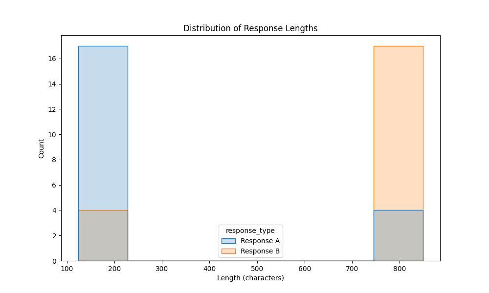
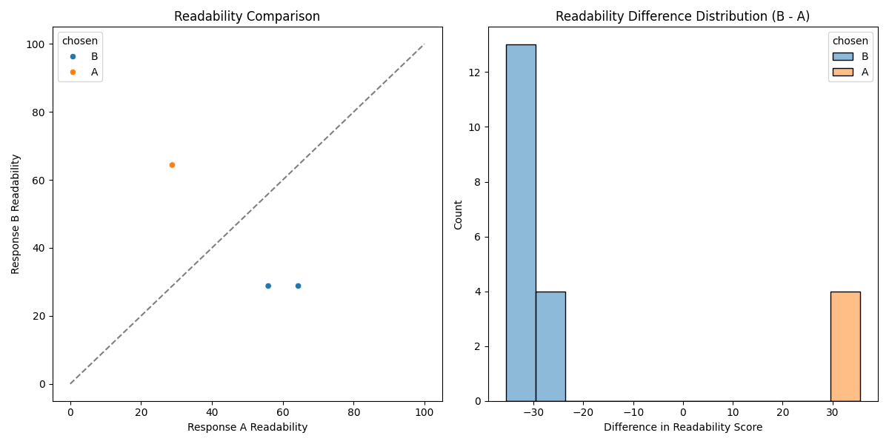
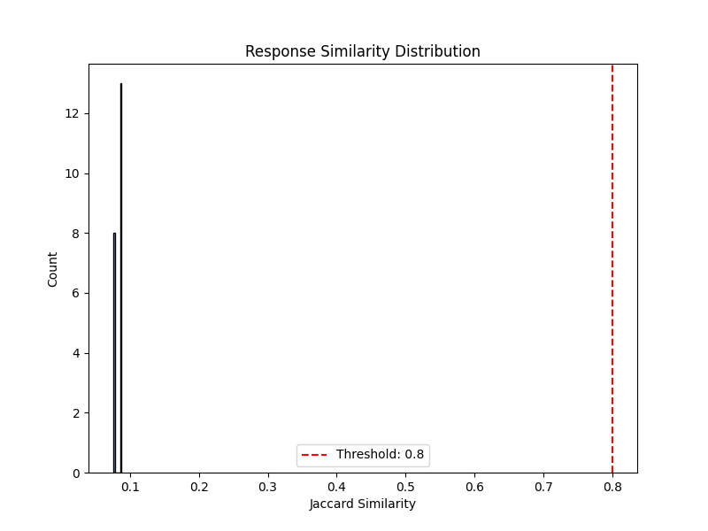
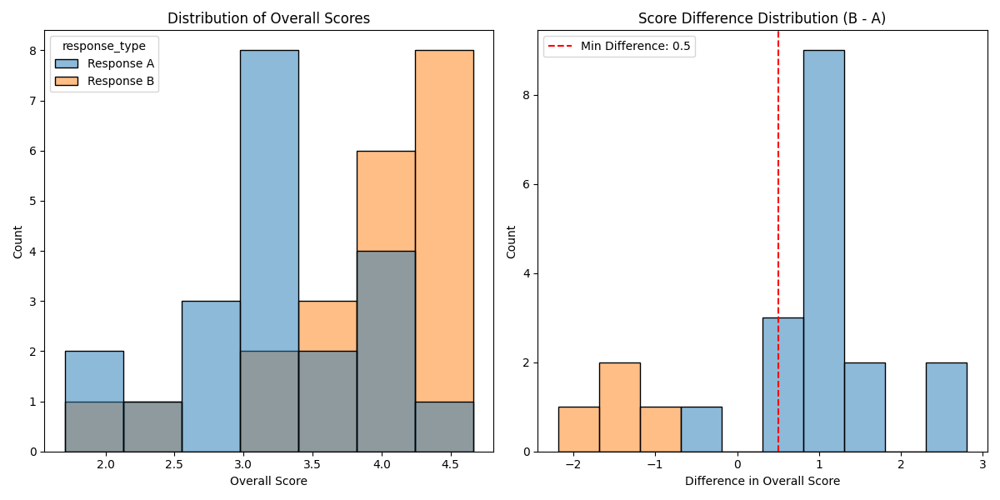
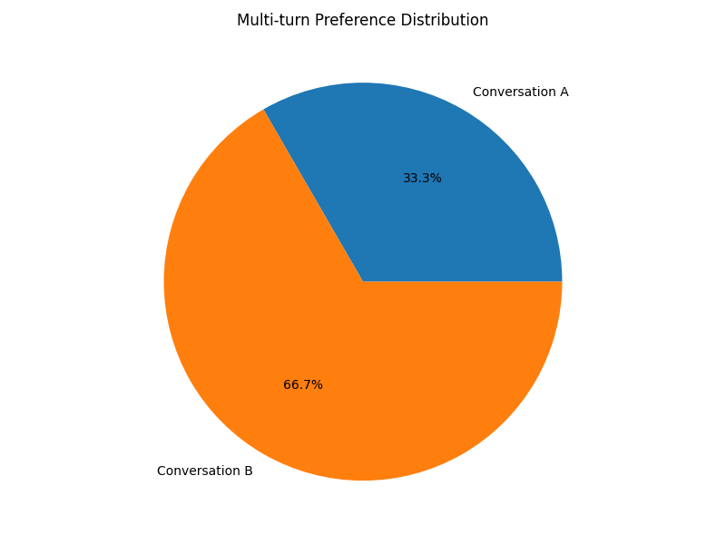

# Preference Dataset Analysis Results

## Basic Statistics

- **total_preference_pairs**: 21
- **chosen_a_percentage**: 19.05
- **chosen_b_percentage**: 80.95
- **avg_response_a_length**: 262.76
- **avg_response_b_length**: 701.24
- **avg_length_difference**: 438.48
- **avg_score_a**: 3.24
- **avg_score_b**: 3.89
- **avg_score_difference**: 0.64

## Response Length Analysis

Average length of chosen responses: 835.67 characters
Average length of rejected responses: 128.33 characters

## Readability Analysis

Average readability of chosen responses: 28.80
Average readability of rejected responses: 62.76

## Response Similarity Analysis

Average similarity between responses: 0.08
Percentage of examples with high similarity (>0.8): 0.00%

## Critique Analysis

Average score of chosen responses: 4.15
Average score of rejected responses: 2.99

## Filtering Results

Original dataset size: 21
Filtered dataset size: 37
Percentage retained: 176.19%

### Filtering Criteria

- Response similarity < 0.8
- Length consistency with preference choice
- Score consistency with preference choice
- Minimum score difference: 0.5

## Multi-turn Conversation Analysis

Total multi-turn conversations: 21
Percentage preferring conversation A: 33.33%
Percentage preferring conversation B: 66.67%
